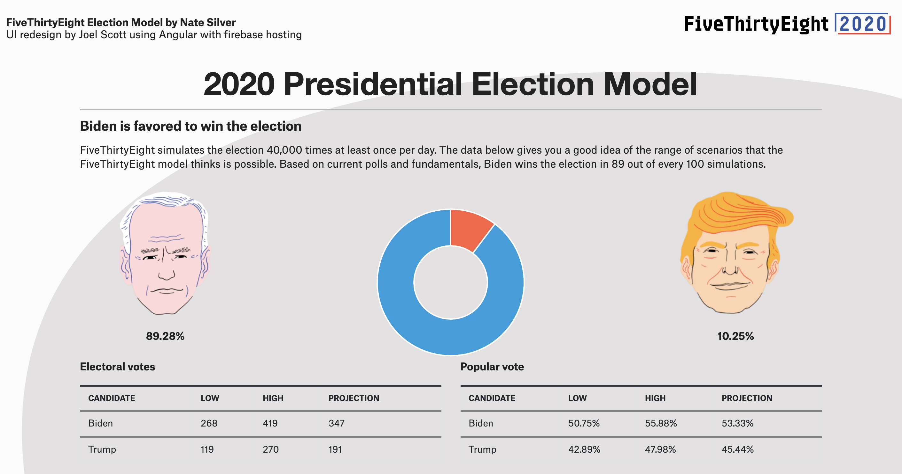
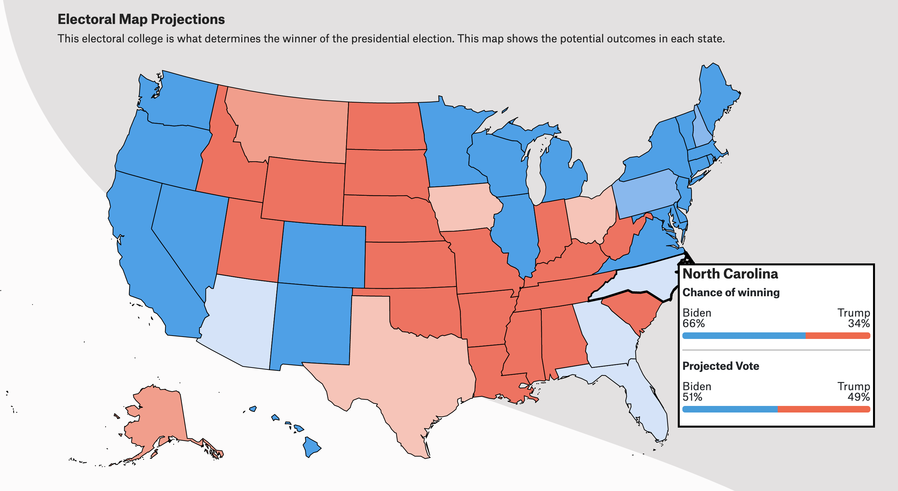
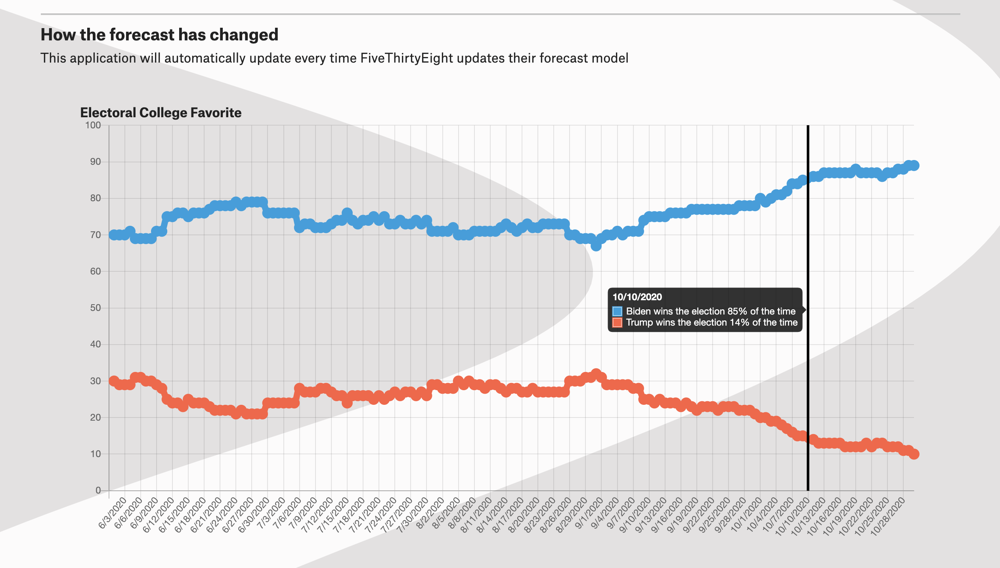

# ElectionForecast

Nate Silver's FiveThirtyEight election model integrated into an Angular UI of my own creation. This application will update everytime fivethirty updates their model.

The data is taken from directly from the publically available csv files containing the fivethirtyeight's forecast data.
This application takes that data and converts it into a JSON format in order to be visualized.

I created this application simply because fivethirtyeight did not include an electoral map in their forecast this year.

Deployed at https://electionforecastjs.web.app/

# Projections

# Electoral Map

# How the Forecast has changed

# Technologies Used

-   Angular
-   Firebase hosting
-   Chart.js
-   FiveThirtyEight's Data
